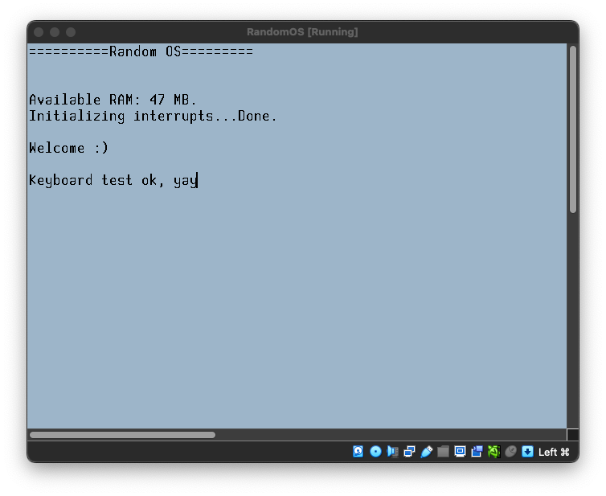

# RandomOS
This is a very basic executable which leans on the grub multiboot2 protocol. The purpose of this project was to understand how the paging system of an x86 processor works along with its different operating modes.

Keyboard works if PS/2 emulation is enabled. Also, a simple frame buffer is managed.

## Build (Linux/MacOS)
In order to generate an ISO (kernel.iso):

 - X86-64 (EFI)
    ```
    docker build -t elf-gcc .
    docker run -v $(pwd):/root/env -it elf-gcc
    make
    ```
- I386
    ```
    docker build -t elf-gcc .
    docker run -v $(pwd):/root/env -it elf-gcc
    make pc
    ```



